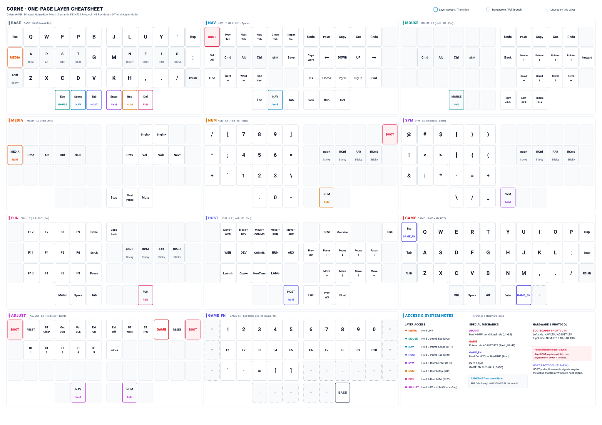
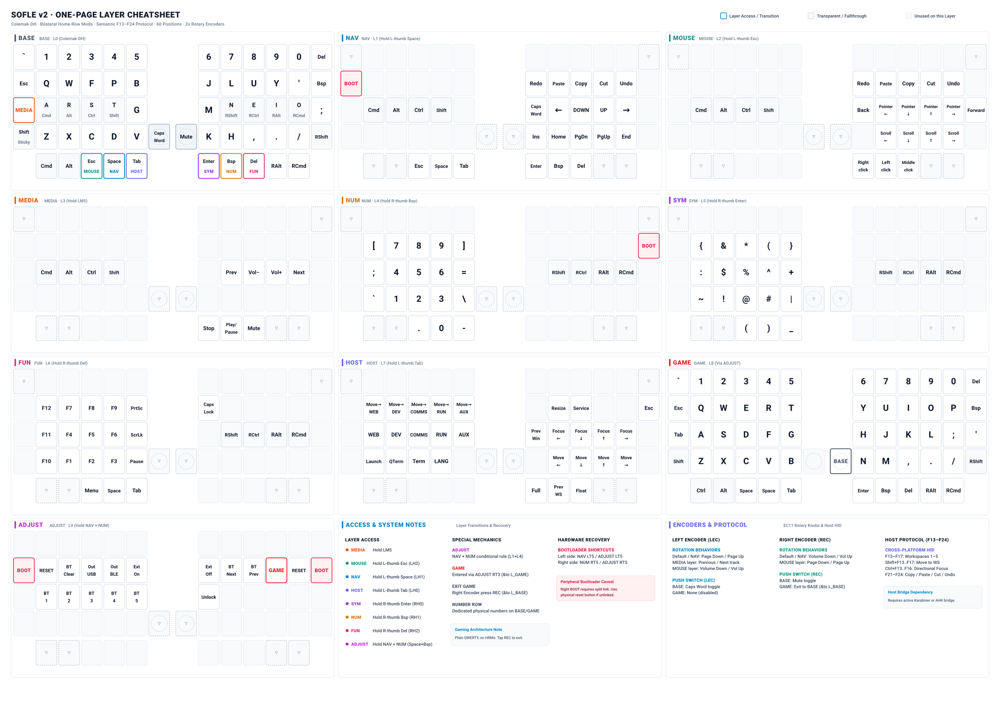

# Keyboard Config

> Personal ZMK keyboard configuration with shared semantic host integration for macOS and Windows.

---

## 1. Top-Level Architecture

```text
Corne ─┐
       ├── Semantic Keyboard Protocol (F13–F24) ─┬── macOS   (OmniWM + SketchyBar + Karabiner + Ghostty)
Sofle ─┘                                        └── Windows (AutoHotkey + GlazeWM + Windows Terminal)
```

Both keyboards share a single, OS-neutral design language:
* Portable Colemak-DH base layer with modern bilateral home-row mods.
* Standardized 6-layer thumb model (NAV, MOUSE, HOST, SYM, NUM, FUN).
* Directional home-row navigation (`← ↓ ↑ →` on `N E I O`).
* Semantic `F13`–`F24` signals for window management, launchers, and desktop editing.
* Complete separation between firmware typing semantics and OS-level host adapters.

---

## 2. Keyboard Comparison Matrix

| Property | Corne | Sofle v2 |
|---|---|---|
| **Firmware Framework** | ZMK | ZMK |
| **Physical Layout** | 42 keys (3×6 + 3 thumbs) | 60 keys (6×4 + 5 thumbs) |
| **Alpha Base** | Colemak-DH | Colemak-DH |
| **Home-Row Mods** | Modern bilateral (`hml`/`hmr`) | Modern bilateral (`hml`/`hmr`) |
| **HOST Layer** | Yes (`F13`–`F20`) | Yes (`F13`–`F20`) |
| **Number Row** | Virtual (`NUM` layer) | Dedicated physical row |
| **Rotary Encoders** | No | 2× EC11 encoders + push switches |
| **Gaming Model** | `GAME` + `GAME_FN` | Single complete `GAME` layer |
| **ZMK Studio** | Enabled with locking | Enabled with locking |
| **Primary Host** | macOS | Windows |
| **Cross-Platform** | Yes | Yes |

---

## 3. Quick Reference Cheatsheets

Single-page, deterministic A4 reference sheets generated directly from firmware keymap semantics and presentation metadata:

### Corne (CRKBD · 42 Keys)


* **Printable Vector PDF:** [`docs/generated/corne-cheatsheet.pdf`](docs/generated/corne-cheatsheet.pdf)
* **Technical Keymap Diagram:** [`keymap-drawer/corne.svg`](keymap-drawer/corne.svg)
* **Cheatsheet Configuration:** [`cheatsheets/corne.yaml`](cheatsheets/corne.yaml)

### Sofle v2 (60 Keys + 2× Encoders)


* **Printable Vector PDF:** [`docs/generated/sofle-cheatsheet.pdf`](docs/generated/sofle-cheatsheet.pdf)
* **Technical Keymap Diagram:** [`keymap-drawer/sofle.svg`](keymap-drawer/sofle.svg)
* **Cheatsheet Configuration:** [`cheatsheets/sofle.yaml`](cheatsheets/sofle.yaml)

---

## 4. Host Integration Matrix
| Feature | Firmware Signal | macOS Adapter | Windows Adapter |
|---|---|---|---|
| **Workspaces 1–5** | `F13`–`F17` | OmniWM `switch-workspace 1..5` | GlazeWM `f13..f17` |
| **Move to Workspace** | `Shift+F13..F17` | OmniWM `move-to-workspace 1..5` | GlazeWM `shift+f13..f17` |
| **Directional Focus** | `Ctrl+F13..F16` | OmniWM `focus left/down/up/right` | GlazeWM `ctrl+f13..f16` |
| **Directional Move** | `Ctrl+Shift+F13..F16` | OmniWM `move left/down/up/right` | GlazeWM `ctrl+shift+f13..f16` |
| **Previous Workspace** | `F18` | OmniWM `switch-workspace back-and-forth` | GlazeWM `f18` |
| **Resize Mode / Cycle** | `Shift+F18` | OmniWM `cycle-size forward` | GlazeWM `shift+f18` |
| **Overview / Service** | `Alt+F18` | OmniWM `toggle-overview` | GlazeWM `alt+f18` |
| **Fullscreen** | `F19` | OmniWM `toggle-fullscreen` | GlazeWM `f19` |
| **Float / Tile** | `F20` | OmniWM `toggle-focused-window-floating` | GlazeWM `f20` |
| **System Launcher** | `Alt+F13` | Spotlight (`Cmd+Space`) | Windows Search (`Win+S`) |
| **Quick Terminal** | `Alt+F14` | Ghostty dropdown (`Ctrl+```) | Windows Terminal Quake (`Ctrl+Alt+```) |
| **New Terminal** | `Alt+F15` | Ghostty window (`Alt+Enter`) | Windows Terminal (`wt.exe`) |
| **Previous Window** | `Alt+F16` | OmniWM (`focus previous`) | Windows (`Alt+Tab`) |
| **Language Toggle** | `Alt+F17` | Input Source (`Ctrl+Space`) | EVKey Toggle (`Ctrl+Shift`) |
| **Select All / Save / Find** | `Hyper+F13..F15` | `Cmd+A` / `Cmd+S` / `Cmd+F` | `Ctrl+A` / `Ctrl+S` / `Ctrl+F` |
| **Tab Management** | `Hyper+F16..F20` | PrevTab / NextTab / New / Close / Reopen | PrevTab / NextTab / New / Close / Reopen |
| **Word Cursor & Find Next** | `Hyper+F21..F23` | `Option+Left/Right` / `Cmd+G` | `Ctrl+Left/Right` / `F3` |
| **Undo / Paste / Copy / Cut** | `F24` / `F22` / `F21` / `F23` | `Cmd+Z` / `Cmd+V` / `Cmd+C` / `Cmd+X` | `Ctrl+Z` / `Ctrl+V` / `Ctrl+C` / `Ctrl+X` |
| **Redo** | `Hyper+F24` | `Cmd+Shift+Z` | `Ctrl+Y` |
| **Standard F1–F12** | `F1`–`F12` | Karabiner normalization when required | Native HID |
| **Brightness** | `C_BRI_DN` / `C_BRI_UP` | Native Consumer HID | Native Consumer HID |

---

## 5. Repository Structure

```text
keyboard-config/
├── config/
│   ├── corne.keymap          # Corne 42-key layout
│   ├── corne.conf            # Corne Kconfig settings
│   ├── sofle.keymap          # Sofle 60-key layout
│   ├── sofle.conf            # Sofle Kconfig settings
│   └── west.yml              # Pinned West dependencies
├── protocol/
│   └── semantic-v1.yaml      # Canonical semantic HID protocol specification
├── cheatsheets/
│   ├── corne.yaml            # Corne cheatsheet styling and palette
│   └── sofle.yaml            # Sofle cheatsheet styling and palette
├── hosts/
│   ├── macos/
│   │   ├── karabiner.json    # Device-scoped complex modifications bridge
│   │   └── ghostty.config    # Terminal & scratchpad config
│   └── windows/
│       ├── keyboard.ahk      # AutoHotkey v2 bridge
│       ├── glazewm.yaml      # Tiling window manager config
│       ├── windows-terminal-actions.jsonc
│       └── README.md
├── keymap-drawer/
│   ├── corne.svg / corne.yaml
│   └── sofle.svg / sofle.yaml
├── scripts/
│   ├── lib/
│   │   ├── keymap_parser.py  # Structured ZMK DTS parser
│   │   ├── protocol.py       # Protocol loader & signal helpers
│   │   ├── validation.py     # Real JSON/YAML/TOML loaders & assertions
│   │   ├── cheatsheet.py     # Semantic model & hold-tap resolver
│   │   └── cheatsheet_svg.py # Deterministic A4 SVG renderer
│   ├── check_corne_keymap.py # Positional invariant validator
│   ├── check_sofle_keymap.py # Positional & encoder validator
│   ├── check_host_protocol.py# End-to-end multi-host protocol validator
│   ├── check_build_config.py # Target matrix & manifest validator
│   ├── check_generated.py    # Freshness & undeclared signal validator
│   ├── generate_protocol_files.py
│   └── generate_cheatsheet.py# First-class cheatsheet SVG/PDF generator
└── docs/
    ├── generated/
    │   ├── corne-cheatsheet.svg / corne-cheatsheet.pdf / corne-cheatsheet.manifest.json
    │   └── sofle-cheatsheet.svg / sofle-cheatsheet.pdf / sofle-cheatsheet.manifest.json
    ├── setup.md
    ├── usage.md
    ├── development.md
    ├── troubleshooting.md
    ├── compatibility.md
    ├── keyboards/
    │   ├── corne.md
    │   └── sofle.md
    ├── hosts/
    │   ├── macos.md
    │   └── windows.md
    └── migration/
        └── sofle-baseline.md
```

---

## 6. Documentation & Guides

- **Architecture:** [docs/architecture.md](docs/architecture.md)
- **Semantic Protocol:** [docs/host-protocol.md](docs/host-protocol.md)
- **Setup & Flashing:** [docs/setup.md](docs/setup.md)
- **Daily Usage & Workflow:** [docs/usage.md](docs/usage.md)
- **Development & Studio Policy:** [docs/development.md](docs/development.md)
- **Troubleshooting Decision Tree:** [docs/troubleshooting.md](docs/troubleshooting.md)
- **Host & Dependency Compatibility:** [docs/compatibility.md](docs/compatibility.md)
- **Corne Reference:** [docs/keyboards/corne.md](docs/keyboards/corne.md)
- **Sofle Reference:** [docs/keyboards/sofle.md](docs/keyboards/sofle.md)
- **macOS Guide:** [docs/hosts/macos.md](docs/hosts/macos.md)
- **Windows Guide:** [docs/hosts/windows.md](docs/hosts/windows.md)
- **Sofle Migration Baseline:** [docs/migration/sofle-baseline.md](docs/migration/sofle-baseline.md)

---

## 7. Static Verification Suite

Run all static invariant, protocol, and cheatsheet checks locally:

```bash
uv run scripts/check_corne_keymap.py
uv run scripts/check_sofle_keymap.py
uv run scripts/check_host_protocol.py
uv run scripts/check_build_config.py
uv run scripts/check_generated.py
```

To regenerate cheatsheet visual reference artifacts (SVG, PDF, and manifest):
```bash
uv run scripts/generate_cheatsheet.py all
```
